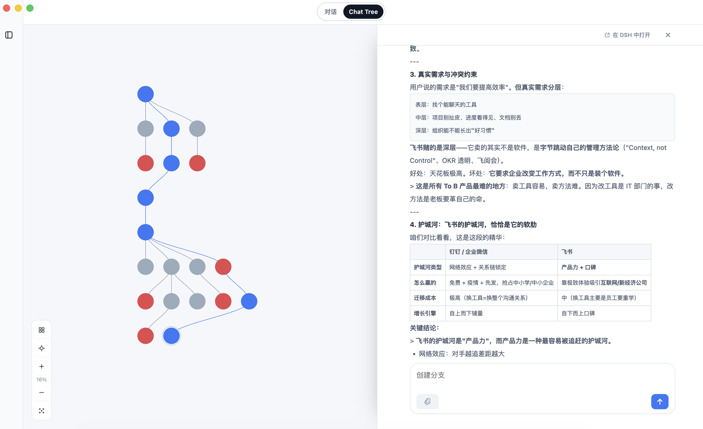
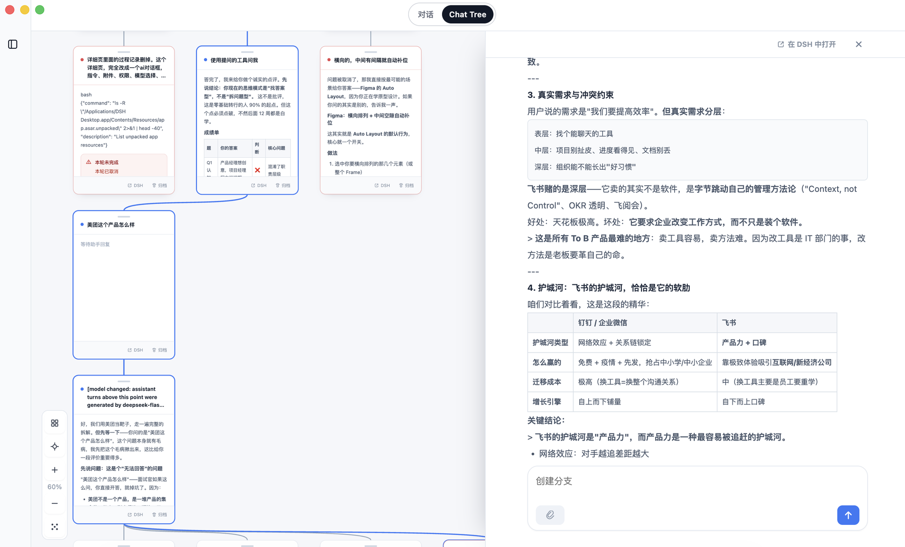

# Chat Tree

**把线性的聊天记录，变成一张可以看、可以点的对话地图。**

Chat Tree 是 [DeepSeek Harness](https://github.com/deepseek-ai)（DSH）的一个插件。它在 DSH 里加一个 **Chat Tree** 视图：每一轮问答变成画布上的一个节点，问题从哪来、往下长出了什么，一眼就能看清。

## 界面

**圆点模式** —— 只有节点和连线，节点上不显示文字，鼠标移上去才浮出你当时提的问题。整个结构一眼看完。



**卡片模式** —— 每个节点是一张卡片，直接读到问答内容。选中一个节点，从它一路回到最开始的那条路径会整条高亮。



右侧面板显示选中那一轮的完整问答，也可以直接在那里继续提问 —— 会从那一轮分叉出新的一条线。

## 它解决什么问题

在 DSH 里聊久了，记录会变成很长的一条：想回头找"当时那个方案是在哪一轮聊的"，只能一直往上翻；想从某一轮**换个方向重新问**，又怕把原来的上下文搞乱。

Chat Tree 把这两件事变成看得见的操作：**每一轮是一个节点，每一次提问都是一条新分支** —— 原来的那条线永远保留，新想法从分叉处长出去。

## 功能

### 画布与节点
- **一轮问答 = 一个卡片节点**，按先后从上往下排列，父节点与子节点之间用平滑曲线连接
- **每一次提问都开一条新分支**：从某一轮继续问，会从那一轮分叉出新的一条线，原线不受影响
- **点节点看全文**：右侧面板显示该轮完整问答，可以直接在那里继续提问
- **支线高亮**：选中一个节点，从根到它的整条路径会高亮，一眼看出"这一轮是怎么来的"
- **归档**：把某个节点连同它下游的所有内容从画布上隐藏（DSH 里的会话不会被删除）
- **整理**：一键按层级重新排列；**定位**：把视角带回最新的一轮
- **拖拽与缩放**：拖动画布平移、滚轮/触控板缩放、拖拽节点位置（刷新后保留）

### 左侧栏：工作区 → 画布

左栏是两级：上面按 **工作区**（DSH 里的目录）分组，每个工作区下面是它的**画布**。

- 点工作区那一行**折叠 / 展开**它；当前画布所在的工作区始终展开，折叠状态会记住
- 点画布那一行切到那张画布
- 工作区行和画布行末尾的 **⋯** → **重命名**。名字**写回 DSH**：DSH 自己的侧栏里也是同一个名字，改哪边都一样
- 「工作区」右边的 **＋** → 打开系统目录选择器，把选中的目录加成一个工作区（已经加过的会提示，不会重复添加）
- 顶部的 **新画布** 先问你**建在哪个工作区**，再在那个目录下创建会话

### 输入框边上的几个按钮

右侧面板底部的输入框旁边有一排：

| 按钮 | 作用 |
|---|---|
| **附件** | 给这条提问带上文件 |
| **权限** | 切换 DSH 的权限预设；**解除沙箱 / 不再逐次征询**这类预设会先要你确认一次 |
| **模型** | 选这个会话用哪个模型和推理等级（按 provider 分组） |
| **上下文** | 圆环是上下文占用比例；点开看百分比，以及 **系统提示 / 工具 / 对话** 各占多少 token |
| **发送** | Enter 发送，Shift+Enter 换行 |

拿不到对应接口时（比如这个 DSH 没提供模型目录），那个按钮就不出现、菜单里会写明原因。

### 压缩上下文

上下文菜单里的 **压缩上下文** 调用 DSH 的 `/compact`：会话历史被替换成一段摘要，后续对话在摘要之上继续。

这件事会在画布上**留下一个绿色节点** —— 卡片模式是绿框，圆点模式是绿点，标题「上下文已压缩」，内容就是那段摘要。**这个节点可以继续对话**：从它提问，新分支的历史从摘要开始。

## 安装

### 前置条件
- DeepSeek Harness **2.0.9 或更高**
- Node.js **22.19+**

### 从 GitHub 安装（推荐）

**DSH Desktop**：打开 DSH Desktop 的终端，那里的 profile 默认就是 `desktop`：

```bash
dsh plugin add "github:RyanZeeee/dsh-chattree"
```

**普通命令行**（`dsh web` 等 profile）：`--profile` 是必填的：

```bash
dsh plugin --profile <name> add "github:RyanZeeee/dsh-chattree"
```

装好后**重启该 profile**，顶部的视图切换条里会出现 **Chat Tree**。

### 从克隆安装

```bash
git clone https://github.com/RyanZeeee/dsh-chattree.git
cd dsh-chattree
dsh plugin --profile <name> add "$PWD"
```

### 本地开发

```bash
git clone https://github.com/RyanZeeee/dsh-chattree.git
cd dsh-chattree
dsh plugin --profile <name> add "$PWD"

pnpm install     # 无第三方依赖，仅用于跑脚本
pnpm test        # 排列规则 + 行为锁定的测试
pnpm run build   # 三个 JS 文件的语法检查
```

改了 `app.js` 或 `styles.css`：刷新 DSH 页面即可。
改了 `index.js` 或 `client.js`：需要重启 DSH。

## 你的数据在哪里

- 画布结构（节点关系、排列、归档）存在 DSH 自己的数据目录里
- **对话内容仍然由 DSH 保存**，插件不改动、不复制会话记录
- 视图偏好（节点位置、左侧栏折叠、画布模式与缩放、快捷词、面板宽度）只存在浏览器本地
- 插件**不联网**：所有请求都是发回 DSH 本体的本地接口（`/chattree/api/*`），没有任何外部请求

## 权限与边界

**依赖**：零运行时依赖。宿主侧只用 Node 内置模块（`node:fs/promises`、`node:crypto`、`node:path`、`node:url`），不 import 任何 `@deepseek-ai/*` 包；与 DSH 的交互靠服务名（`webServer`、`sessions`）和 `remote.*` 命名空间。前端半体（`client.js`）注入 `@deepseek-ai/dsh-client-runtime`（`dsh.client.inject`，由 DSH 的客户端模块加载器提供，不是 npm 依赖）。

**权限** —— 下面就是全部：

| 面 | 实际做了什么 |
|---|---|
| 文件 | 只写一个文件：`$DSH_HOME/chattree/workspaces.json`（路径可由 profile 的 `dataFile` 覆盖，见 `cordis.patch.yml`）；同目录一个 `workspaces.json.lock`（PID 锁，进程退出即释放，过期锁自动回收）；读取自己安装目录下的 `app.js` / `styles.css` 用于提供服务。不读 DSH 的会话文件，不碰任何其他路径 |
| 网络 | **不发起任何对外请求**。宿主侧在 DSH 自己的 web server 上注册同源路由（`/chattree/…`），画布页面用相对路径访问它们；`Host` 不在白名单（`localhost`、`127.0.0.1`，加上 profile 里 `trustedHosts` 的附加项）一律返回 403 |
| 命令 | 不启动子进程，不执行 shell |
| 凭据 | 不读环境变量里的密钥，不持有任何令牌 |

**外部服务**：无。没有第三方主机、没有遥测、没有自己的模型调用——所有模型调用都发生在你正在用的那个 DSH 会话里。

**失败边界**：

- 数据文件不存在 → 建一个空图；你的会话本身不受影响
- 数据文件损坏或读不出来 → 拒绝读取并**报出具体路径**，不静默覆盖你的数据。画布相关请求会失败，DSH 本身照常运行——插件挂载不依赖这次读取
- 同时运行两个实例 → PID 锁阻止互相覆盖；锁的持有者已消失时自动回收，并在 stderr 打印一条警告
- DSH 没提供某个可选接口（模型目录、命令列表等）→ 对应按钮不出现在输入区，其余照常，并在菜单里写明原因
- 某条会话历史读不出来 → 记一条警告并跳过该条，实时投影不受影响
- 卸载 → 路由随之消失；`workspaces.json` 保留（想彻底清掉就删掉那个文件）

**想自己验一遍**（用一次性 profile，不碰你日常那份）：

```bash
dsh --profile chattree-check --from-default-profile web                  # 造一个一次性 profile
dsh plugin --profile chattree-check add github:RyanZeeee/dsh-chattree    # 装
dsh --profile chattree-check                                             # 启：顶部应出现 Chat Tree
dsh plugin --profile chattree-check remove dsh-chattree                  # 卸
rm -rf ~/.dsh/profiles/chattree-check                                    # 删干净
```

## 环境要求

- DeepSeek Harness 2.0.9 或更高
- Node.js 22.19+

DSH Desktop 和普通 `dsh web` profile 都能用：插件只依赖官方 DSH contract，不使用 Desktop 专有的 `desktopProfiles` / `desktopPnpm`。

## 许可

MIT
